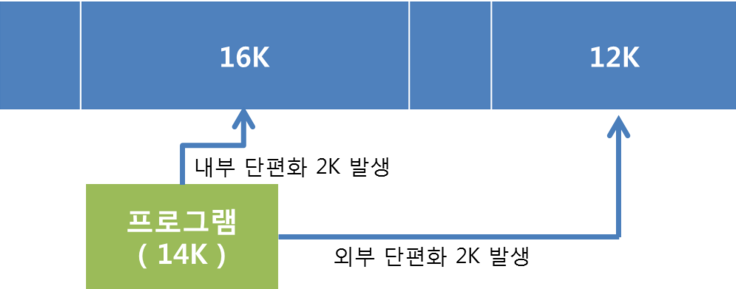

# 주기억장치

### 주기억장치란?
   - cpu(중앙처리장치)가 직접 접근하여 처리할 수 있는 하드웨어 기억장치로 컴퓨터 내부에 존재
   - 수행되는 프로그램과 데이터를 저장(응용프로그램과 시스템프로그램 저장)
   - 프로그램 기억영역, 입력자료 기억영역, 출력자료 기억영역으로 구성
   - 전원이 꺼져도 내용이 보존되는 ROM과 전원이 꺼지면 모든 내용지 지워지는 RAM으로 분류

***
### 1. ROM(Read Only Memory)
말그대로 읽기전용 메모리. 기억된 내용을 읽을 순 있어도 바꿀수 없는 반도체 기억장치.

전원이 끊겨도 기억된 내용지 지워지지 않는 비휘발성 특징을 가지고 있음

RAM에 비해 비교적 느리다

주로 입출력시스템(BIOS), 자가 진단 프로그램(POST)같은 변경 가능성이 적은 시스템소프트웨어를 저장

### 2. RAM(Random Access Memmory)
기억 장소를 임의로 접근할 수 있는 메모리

새로운 내용을 기억시킬 수 있고, 기억된 내용을 읽을 수 있음

전원을 끄면 지워지는 휘발성 메모리

저장되는 메모리
   - 메모리에 있는 데이터의 위치를 나타내는 주소
   - 값
   - 명령어

컴퓨터 속도에 영향을 줌

   - SRAM (Static RAM : 정적) : 컴퓨터가 켜있으면 내용이 사라지지않음
   - DRAM (Dynamic RAM : 동적) : 일정 시간마다 내용이 사라짐
   
   
### 주기억장치 관리전략
   - 반입(Fetch) : 보조기억장치에 보관중인 프로그램이나 데이터를 언제 주기억장치로 적재할 것인지 결정
   - 배치(Placement) : 새로 반입되는 프로그램이나 데이터를 어디에 위치시킬 것인가 결정
   - 교체(Replacement) : 모든 영역이 이미 사용중인 상태에서 새로운 프로그램이나 데이터를 어디 영역과 교체하여 사용할 것인지 결정

   
   
### 단편화
주기억장치를 분할하여 프로그램이나 데이터를 할당했을때 사용되지 않고 남은 조각
* 내부단편화 : 주기억장치의 분할공간이 프로그램보다 커서 할당된 후 남은 빈공간
* 외부단편화 : 주기억장치의 분할공간이 프로그램보다 작아 사용하지 못하고 빈공간으로 남게되는 영역

해결방법 
   1. 통합기법 : 주기억장치 내에 인접해 있는 단편화된 공간을 하나의 공간으로 통합
   2. 압축기법 : 주기억장치내에 분산된 여러개의 낭비공간을 모아 큰 기억공간을 만듦
   3. 기억장소 재배치 : 압축기법을 수행할 때 각 프로그램에 주어진 분할 영역의 주소를 새롭게 지정
   
### 주기억장치 할당기법
프로그램이나 데이터를 실행시키기위해 주기억장치에 어떻게 할당할 것인지에 대한 내용

1. 단일 분할 할당 : 주기억장치를 운영체제 영역과 사용자 영역으로 나누어 한 순간에 한 사용자만 사용자 영역을 사용
   - 오버레이
   - 스와핑
2. 고정 분할 할당 : 프로그램 할당 전 운영체제가 주기억장치의 사용자 영역을 여러 개의 고정된 크기로 분할 하고 준비상태 큐에서 준비중인 프로그램을 각 영역에 할당하여 수행
3. 가변 분할 할당 : 고정 분할 할당 기법의 단편화를 줄이기 위해 미리 분할해 놓는것이 아니라 프로그램을 주기억장치에 적재하면서 필요한 만큼의 크기로 영역 분할

---------------------------------------------
참고

<a>https://blog.naver.com/bsy9109/130167397314</a>
<a>http://blog.naver.com/PostView.nhn?blogId=sayme4233&logNo=220363443440</a>
