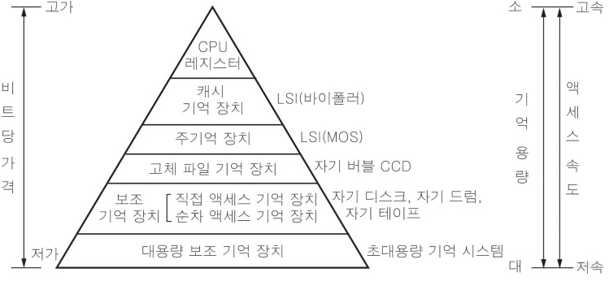

# 보조기억장치    

## 보조기억장치란?    

CPU(중앙처리장치) 외부에 존재하며, 주기억장치의 용량을 보조하기 위해 사용하는 것이다.  
주기억장치의 단점을 보완하기 위해 등장하였다.    

## 특징  

- 주기억장치에 비해 속도가 느리다. 약 1000배 정도  
- CPU와 직접 자료 교환 불가 -> CPU는 주기억장치와 교환가능 ==> 그러므로 접근시간이 오래걸린다.  
- 전원이 차단되어도 내용이 유지된다.  
- 저장용량이 크다.  
- 주기억장치보다 싸다.  

  

  

## 종류  
- 하드디스크(HDD)  

- 자기디스크  
- 자기테이프    

- 광디스크  
> 대용량 정보를 기록, 멀티미디어 데이터저장에 주로 사용 EX) CD, DVD  

- RAID  
> 저렴하고 크기가 작으 여러개의 독립 하드 디스크들을 묶어서 하나의 기억장치처럼 사용하는 방식  
> 여러 개의 독립된 디스크들이 일부 중복된 데이터를 나누어 저장하여, 성능을 향상시킨다.  
> 데이터를 나누는 방법에 따라 0~6레벨까지 존재  
> 레벨은 접근속도와 보존신뢰에 따라 결정됨 EX) 데이터베이스 정보 저장  

- 플래시기억장치  
> RAM과 ROM의 중간적 위치  
> 하드디스크보다 접근속도 빠르다. 그리고 충격에 강하다.  
> 사용회수 제한으로 인해 주기억장치 불가  EX) USB, SD카드

