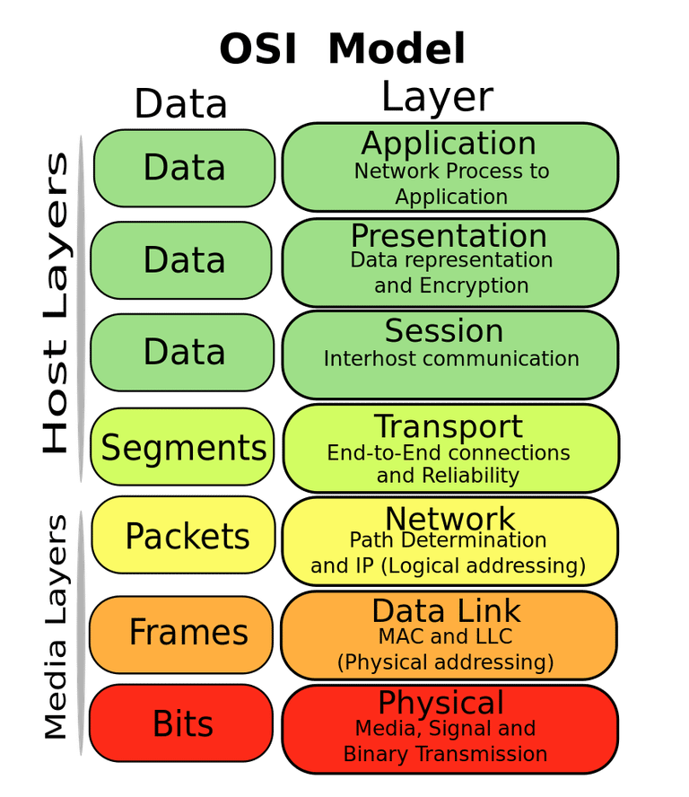

# OSI 7 계층  

### OSI 7 계층이란?  

- ISO에서 개발한 모델로, 컴퓨터 네트워크 프로토콜과 통신을 계층으로 나누어 설명한 것  
- 계층을 활용하여 통신을 시각적으로 쉽게 설명 가능  
- 네트워크 관리자가 문제의 원인을 파악하기 용이  
- 프로그래머도 어떤 꼐층에 작업이 필요한지 쉽게 파악 가능  

  

**7계층 응용 계층**  

- 사용자에게 보여지는 부분, 유저 인터페이스를 제공하는 영역  
- 사용자와 직접적으로 상호작용한다.  
- 구글, 크롬, 사파리, 파이어폭스등 웹브라우저나 스카이프, 아웃룩, 오피스등의 응용프로그램이 대표적이다.  

**6계층 표현 계층**  

- 응용 계층의 데이터 표현에서 독립적이다.  
- 응용 프로그램 형식을 네트워크 형식으로 변환하거나, 네트워크 형식을 응용프로그램 형식으로 변환한다.  
- 즉, 응용프로그랢이나 네트워크를 위해 데이터를 표현하는 것이다.  
- 이 계층에서 대표적으로 데이터를 안전하게 전송하기 위한 암호화, 복호화 작업이 이루어진다.  

**5계층 세션 계층**  

- 컴퓨터간, 서버간 대화를 하기 위해선 세션이 필요하다.  
- 데이터가 통신하기 위한 논리적인 연결이다.  
- 세션을 만들고 없애는 기능을 담당한다.  
- 통신 경로 확립이나 단절, 전달방식을 정한다.  

**4계층 전송 계층**  

- 전송방식, 보낼 데이터의 용량과 속도, 목적지 등을 처리한다.  
- 전송방식에는 TCP, UDP 두가지가 있다.  
- 포트번호를 구분하는 계층  

**3계층 네트워크 계층**  

- 다른 여러 라우터를 통한 라우팅, 또는 패킷전달을 담당한다.  
- IP관리와, 경로설정을 담당한다.  
- 이 계층에서는 데이터를 목적지까지 가장 안저낳고 빠르게 전달하는 기능(라우팅)이 가장 중요하다.  

**2계층 데이터링크 계층**  

- 포인트 투 포인트간 신뢰성 있는 전송을 보장하기 위한 계층  
- 물리계층을 통해 송수신되는 정보의 오류와 흐름을  관리하여, 안전한 정보의 전달을 수행할 수 있게 도와준다.  
- 전송 단위는 '프레임'이다.  
- 대표적인 장비로는 브리지, 스위치 등이 있다.  
- 브리지나 스위치를 통해 맥주소를 가지고 물리계층에서 받은 정보를 전달한다.  
- 2개의 부계층이 존재한다. 매체 접근 제어(MAC)계층, 논리적 연결 제어(LLC)계층  

**1계층 물리 계층**  

- 시스템의 전기적, 물리적 표현을 나타낸다.  
- 네트워킹 문제가 발생하면 가장 먼저 물리 계층을 확인한다.(케이블이 연결되어있는지, 라우터나 스위치 또는 컴퓨터에서 전원플러그가 빠지지 않았는지..)  
- 단순히 데이터를 전기적인 신호로 변환해서 주고받는 기능만 한다.    

  

