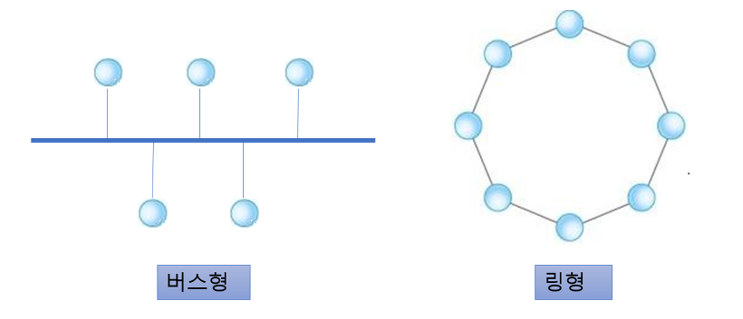

# 컴퓨터 네트워크 데이터 전송 방식

 
 네트워크란?
 
  - 네트워크는 독립적으로 실행되는 호스트들을 연결해 하나의 통신망을 구성하는 것
  - 네트워크 사용 효과 
    1. 자원 공유
    2. 병렬 처리에 의한 성능 향상
    3. 중복 저장으로 인한 신뢰성 향상
 
 한 시스템에서 다른 시스템으로 데이터를 보내는 과정을 __데이터 전달__ 이라고 한다.
 데이터 전달에는 __교환__ 과 __전송__ 두 가지 과정이 존재한다.
 교환은 둘 이상의 경로 중에 어느 방향으로 전달할지 선택을 하는 과정이고 전송은 물리적으로 1:1 연결된 시스템 사이의 데이터 전송을 의미한다.

a에서 d로 데이터를 전달하려고 하려면 우선 a에서 c로 전송이 이루어지고 c에서 교환 과정을 거친다. 어디로 데이터를 전송할지에 대해 고민을 하고 c에서 d로 데이터를 전송한다.

## 전송방식

 전송 교환 기술에 의해 __점대점__ 과 __브로드캐스팅__ 으로 분류할 수 있다.
 점대점방식은 호스트들이 물리적으로 1:1형식으로 연결되어있는 형태이고 브로드캐스팅은 호스트들이 공유 전송 매체에 연결되어 있는 형태
 
 
### 점대점 방식
 
 - 교환호스트가 송수신 호스트 중간에 위치하여 데이터를 전달할 때 호스트들을 직접 연결하거나 중계기능을 통해 전달
 - 전송 매체의 개수가 많아지면 성능 면에서 우수하나 매체 길이가 증가하여 비용이 증가
 - 연결 개수가 적어지면 네트워크 트래픽이 증가하여 네트워크 혼잡도가 증가
 - 주로 WAN과 같은 넓은 크기의 네트워크에 적용

#### 점대점 방식의 종류

* 스타형 : 중앙 중개 호스트(허브 : hub)를 거쳐 데이터를 송수신하는 방식이다. 중앙에 있는 하나의 중개 호스트 주위로 여러 호스트를 일대일로 연결하는 형태이다. 모든 데이터가 중앙 호스트를 중심으로 라우팅되므로 중개 과정이 간단하나 중앙 호스트에 문제가 발생하면 전체 네트워크의 동작에 영향을 많이 준다. 따라서 중앙 호스트의 성능과 신뢰성이 중요하다. 스타형의 구조를 확장하면 트리형 구조가 된다.

* 링형 : 호스트의 연결이 순환 구조를 이루는 형태이다. 모든 호스트가 전송과 교환 기능을 수행한다. 하지만 한 방향으로 전송을 하는 형태가 대부분이므로 교환 기능은 사용하지 않는다. 링 구조는 데이터 충돌이 일어날 수 있으므로 토큰을 가져 전송 권한을 통해 데이터를 전송한다. 이 구조의 경우 한 호스트가 고장이 나면 전체 네트워크가 동작하지 않을 수 있다.

* 완전형 : 네트워크에 존재하는 모든 호스트를 1:1로 연결한다. 따라서 교환 기능이 불필요하다. 하지만 비용 측면에서 전송 매체의 개수가 많이 증가하게 되므로 극단적으로 비효율적이다.

* 불규칙형 : 말 그대로 전송 매체에 의해 연결 구조를 특정 패턴으로 분류할 수 없는 형태이다. 그래서 불규칙형을 설계할 때 트래픽이 많은 지역은 연결 수가 많게, 트래픽이 적은 지역은 연결의 수를 적게 제작하면 효율적이라고 할 수 있다.

### 브로드캐스팅 방식
 
 - 네트워크에 연결된 모든 호스트에게 데이터를 전달하는 방식
 - 모든 호스트를 하나의 전송 매체로 연결하므로 중개 기능을 수행하는 교환 호스트가 필요 없음
 - 주로 LAN과 같은 넓은 크기의 네트워크에 적용

#### 브로드캐스팅 방식의 종류

* 버스형 : 공유 버스에 모든 호스트를 연결하는 형태이다. 둘 이상의 호스트가 데이터를 동시에 전송하면 충돌이 발생한다. 이를 해결하기 위한 방법은 두 가지 정도가 있는데 사전 예방 방식으로 전송 시간대를 다르게 하거나 토큰 제어하는 방식이 있고 사후 해결 방식으로 충돌을 감지하여 후에 처리하는 방식이다.

* 링형 : 호스트를 순환 구조로 연결하는 것이다. 송신 호스트가 전송한 데이터를 링을 한 바퀴 순환한 후 송신 호스트에 되돌아온다. 중간의 호스트 중에서 수신 호스트로 지정된 호스트만 데이터를 내부에 저장하고 다른 호스트는 버린다. 충돌에 의한 제어는 토큰 제어 방식(전송 권한)을 택하여 수행한다.

### 멀티포인트 통신
 하나의 호스트가 다수의 수신 호스트와 연결을 하는 형태

멀티포인트 통신은 하나의 호스트가 다수의 수신 호스트와 연결을 하는 형태이다. 이와 반대의 개념은 유니포인트로 하나의 수신호스트와 연결을 하는 형태가 있다. 따라서 멀티캐스팅은 다수의 수신 호스트에 데이터를 전송해주는 형태이고 유니캐스팅은 하나의 수신 호스트에 데이터를 전송하는 형태이다. 멀티포인트 유니캐스팅은 유니캐스팅 방식을 이용하여 일대다 통신을 지원하는 것을 말한다. 하나의 호스트가 다수의 수신 호스트와 연결되어 있는데 다수의 송신 절차를 통해 데이터를 전달한다. 수신 호스트의 수가 증가하면 성능에 문제점이 발생한다. 멀티캐스팅은 1:n 전송 기능을 지원한다. 송신 호스트는 한 번의 데이터 전송으로 여러 호스트에게 데이터를 전송할 수 있다. 
