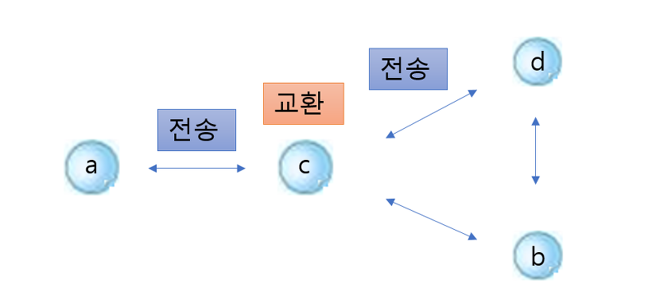
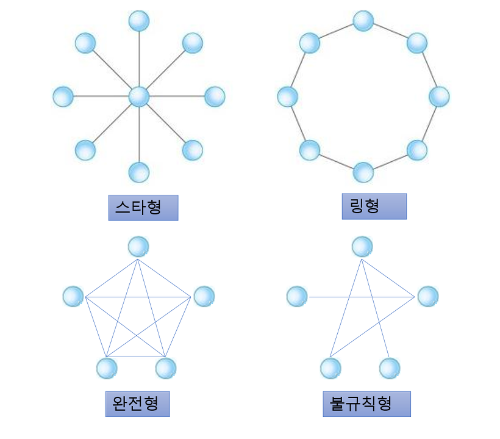

# 컴퓨터 네트워크 데이터 전송 방식

 
 네트워크란?
 
  - 네트워크는 독립적으로 실행되는 호스트들을 연결해 하나의 통신망을 구성하는 것
  - 네트워크 사용 효과 
    1. 자원 공유
    2. 병렬 처리에 의한 성능 향상
    3. 중복 저장으로 인한 신뢰성 향상
 
 한 시스템에서 다른 시스템으로 데이터를 보내는 과정을 __데이터 전달__ 이라고 한다.
 데이터 전달에는 __교환__ 과 __전송__ 두 가지 과정이 존재한다.
 교환은 둘 이상의 경로 중에 어느 방향으로 전달할지 선택을 하는 과정이고 전송은 물리적으로 1:1 연결된 시스템 사이의 데이터 전송을 의미한다.

a에서 d로 데이터를 전달하려고 하려면 우선 a에서 c로 전송이 이루어지고 c에서 교환 과정을 거친다. 어디로 데이터를 전송할지에 대해 고민을 하고 c에서 d로 데이터를 전송한다.

## 전송방식

 전송 교환 기술에 의해 점대점과 브로드캐스팅으로 분류할 수 있다.
 점대점방식은 호스트들이 물리적으로 1:1형식으로 연결되어있는 형태이고 브로드캐스팅은 호스트들이 공유 전송 매체에 연결되어 있는 형태
 
 
### 점대점 방식
 
 - 교환호스트가 송수신 호스트 중간에 위치하여 데이터를 전달할 때 호스트들을 직접 연결하거나 중계기능을 통해 전달
 - 전송 매체의 개수가 많아지면 성능 면에서 우수하나 매체 길이가 증가하여 비용이 증가
 - 연결 개수가 적어지면 네트워크 트래픽이 증가하여 네트워크 혼잡도가 증가
 - 주로 WAN과 같은 넓은 크기의 네트워크에 적용

#### 점대점 방식의 종류

* 테이블(table) : 데이터를 체계화하여 행과 열의 형태로 구성한 것으로 테이블 이름을 붙인다.
* 열(column) : 필드(field) 라고도 부르며, 항목의 속성(명칭)을 나타낸다.  필드 마다 각각 정수, 텍스트 같은 데이터 유형을 정할 수 있다. 
* 행(row) : 레코드(record) 라고도 부르며, 각 데이터 항목을 저장한다. 
* 스키마(schema) : 필드는 데이터 유형뿐만 아니라 제약사항도 지정할 수 있는데 이러한 제약사항을 스키마라고 부른다. 예를들어 필드는 중복 값을 해당 행에 저장할 수 없다거나, 반드시 값을 가져야 한다(not null)는 조건 등을 걸 수 있다.
* 키(key) : 레코드를 구성하는 필드에서 각 레코드를 구분할 수 있는 필드 값을 뜻한다.

