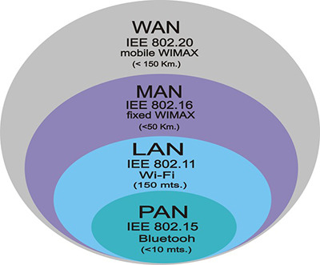
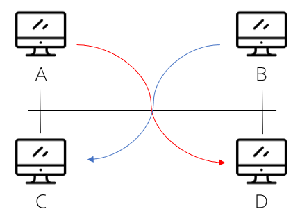
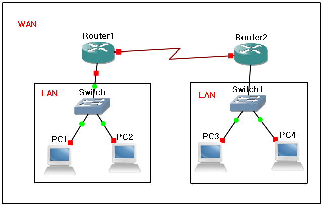
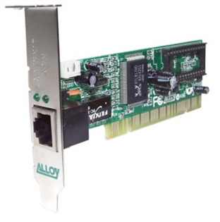
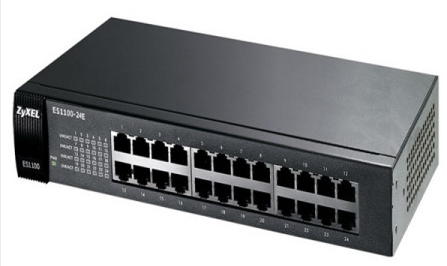
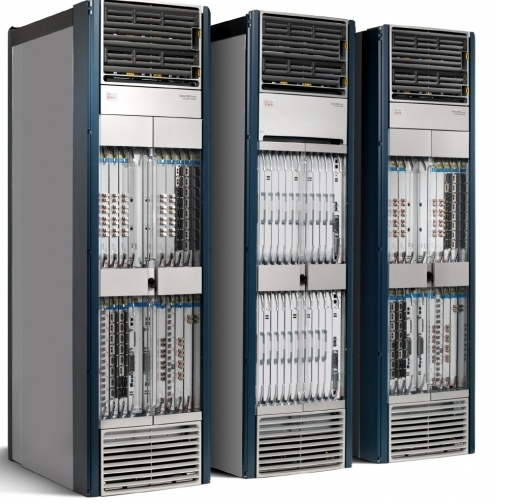

# 네트워크란 무엇인가?

네트워크는 Net + Work 의 합성어로써 컴퓨터들이 통신 기술을 이용하여 그물망처럼 연결된 통신 이용 형태를 의미합니다.

좀더 쉽게 말하자면 **"두 대 이상의 컴퓨터들을 연결하고 서로 통신(이야기)할 수 있는 것"** 이것이 바로 네트워크 입니다. 누구는 네트워크의 정의를 이렇게 내립니다. '어떤 연결을 통해 컴퓨터의 자원을 공유하는 것'이라고 말이죠.

IEEE(Institute of Electrical and Electronics Engineers:국제 전기 전자 공학회)에서는 네트워크를 다음과 같이 정의 하였습니다. "몇 개의 독립적인 장치가 적절한 영역내에서 적당히 빠른 속도의 물리적 통신 채널을 통하여 서로가 직접 통신할 수 있도록 지원해 주는 데이타 통신 체계"라고 말입니다.

# **네트워크의 장단점**

### **장점**

네트워크의 장점을 말하자면 우리는 

1. **파일공유**를 통해 다른 네트워크에 있는 컴퓨터의 파일에 접근 할 수 있게되고, 

2. **미디어 스트리밍**으로 사진, 음악 또는 비디오 등의 디지털 미디어를 네트워크를 통해 재생할 수 있게 되며, 

3. **광대역 인터넷 연결을 공유**할 수 있게되어 각 PC 마다 별도의 인터넷 계정을 구입할 필요가 없게됩니다. 

4. 또한 **프린터 공유**로써 각 PC 마다 프린터를 공유하는 대신 한대의 프린터를 구입하여 네트워크에 있는 모든 사람이 사용할 수 있게 되며, 

5. 무엇보다 인터넷에서 **다른 사람과 만나 PC, 게임 콘솔 등을 통해 네트워크 게임**을 즐길수 있습니다. 

6. 또한 유선으로 책상에서만 PC 작업을 해야 한다는 제약조건이 있다면 **무선전파를 이용한 무선 네트워크로 책상에서 벗어나 웹작업을 할수 있다는 큰 장점**을 가지게 됩니다.

### **단점**

단점으로는 바이러스나 악성코드, 원치 않는 정보를 받게 되며 해킹으로 인한 개인 정보 유출 등 네트워크가 가능 해지면서 보안상의 문제점이 생기며 되며 무엇보다 데이터 변조가 가능하다라고 볼수 있겠습니다.

# **네트워크의 종류**

  

- PAN ( Personal Area Network ) : 가장 작은 규모의 네트워크
- **LAN ( Local Area Network ) : 근거리 영역 네트워크**
- MAN (Metropolitan Area Network) : 대도시 영역 네트워크
- **WAN (Wide Ares Network) : 광대역 네트워크**
- VAN (Value Added Network) : 부가가치 통신망 정보의 축적과 제공, 통신속도와 형식의 변화, 통신경로의 선택 등 여러 종류의 정보서비스가 부가된 통신망.
- ISDN (Integrated Services Digital Network) : 종합정보 통신망(=BISDN) 전화, 팩스, 데이터 통신, 비디오텍스 등 통신관련 서비스를 종합하여 다루는 통합서비스 디지털 통신망. 디지털 전송방식과 광섬유 케이블 사용. 꿈의 통신망이라 불립니다.

추가적인 네트워크 종류로는 WLAN, SAN, CAN, GAN, VPN, ISDN, Intranet, Extranet..등 분류하게 됩니다.

# 이더넷과 인터넷

**네트워크**는 **전송매체의 연결로 구성된 장치들의 모임**이라고 할 수 있습니다. 여기에서 전송매체란 유선의 경우 우리가 흔히 얘기하는 랜케이블이 될 수도 있고 무선 Wi-Fi 를 통해 연결되는 형태를 취할 수도 있습니다.

 그 외에도 장비간 연결은 동축케이블, 광케이블 등 여러가지 유선매체들이 존재하죠. 그럼 그런 전송매체들의 연결로 구성된 장치들은 무엇이 있을까요? 

우리가 업무를 보며 사용하게 되는 컴퓨터(PC, 노트북, 워크스테이션, 서버 등), 모바일 장치(스마트폰, 탭북, 노트북, 게임장치 등), 각각의 장치들이 통신할 수 있도록 연결고리 역할을 수행하는 라우터(Router), 스위치(Switch), 허브(Hub) 등 이라고 할 수 있습니다. 

네트워크는 이런 장치들끼리 통신하기 위해 특정 전송매체를 통해 연결되어 있는 집합체라고 볼 수 있습니다. 

이 범위에 따라 근거리통신망인 LAN(Local Area Network)과 원거리통신망인 WAN(Wide Area Network)로 구분지을 수 있습니다.

'**LAN'**이란 'Local Area Network'의 약자로 Local, 즉 **'어느 한정된 공간에서 네트워크를 구성한다는 것'**입니다.  

비교적 가까운 거리에 위치한 장치들이 특정 전송매체로 연결된 모임으로 하나의 사무실 내, 혹은 여러개의 사무실, 그 범위를 조금 넘어 건물 간에 연결된 네트워크를 말합니다.

LAN 과 비교되는 말로 '**WAN'**이 있습니다.

WAN은 'Wide Area Network'의 약자로서 **'멀리 떨어진 지역을 연결하는 경우'**에 사용합니다. 

최소 두 개 이상의 LAN 이 넓은 지역에 걸쳐 연결된 형태를 의미하며 지역간, 더 나아가 국가간 서로 연결하는 네트워크를 의미합니다.

두 개 이상의 LAN 이 서로 통신하기 위해서는 기본적으로 라우터(Router) 라는 장치를 필요로 하게 됩니다.

요즘은 모두 인터넷을 사용하는 세상이니 인터넷에 접속하는 거는 WAN 이라고 봐야 할 겁니다. 그래서 요즘은 네트워킹을 한다고 하면 주로 LAN과 WAN이 공존합니다. 

결론은 **LAN은 한정된 지역 안에서의 네트워크 구축이고, WAN은 서로 멀리 떨어진 곳을 네트워크로 연결하는 것**입니다. 

그럼 이더넷(Ethernet)은 또 뭘까요??? ( LAN의 통신 Protocol )

이더넷은 네트워킹의 한 방식이라고 생각하면 됩니다. 즉 네트워크를 만드는 방법 중 하나라고 생각하면 됩니다. LAN(Local Area Network)를 위해 개발된 근거리 유선 네트워크 통신망 기술입니다.

이더넷(Ethernet)의 가장 큰 특징은 **CSMA/CD**라는 프로토콜을 사용해서 통신한다는 것 입니다.

우리가 사용하고 있는 네트워킹 방식의 90% 이상이 바로 이런 이더넷 방식을 사용하기 때문에 이더넷에 대해 어느정도 이해해야 합니다. 

네트워킹 방식은 이더넷 방식 말고도 토큰링(Token-Ring) 방식도 있고, FDDI 방식도 있고, 또 ATM 방식도 있습니다. 

## 이더넷

- 가장 대표적인 버스형태 LAN
- LAN카드에서 컴퓨터 고유주소인 MAC주소로 통신
- 사용자가 직접 구축, 관리 가능 → 내부 통신 요금이 없음
- csma/cd 프로토콜 사용

**이더넷의 장점**

- 적은 용량의 데이터를 전송할 경우 성능이 우수하다.
- 설치 비용이 저렴하고 관리가 쉽다.
- 네트워크 구조가 단순하다.

**이더넷의 단점**

- 네트워크 사용 시에 신호 때문에 충돌이 발생한다.
- 충돌이 발생하면 네트워크에서 지연이 발생한다.
- 시스템의 부하가 증가하면 충돌도 계속적으로 증가한다.

**CSMA/CD의 방식**

CSMA/CD 는 LAN의 통신 프로토콜의 종류중 하나이며, 이더넷 환경에서 사용합니다. CSMA/CD는 Carrier Sense Multiple Access/Collision Detetion의 줄임말로, 즉, '대충 알아서 눈치껏 통신하자' 라는 방식의 프로토콜입니다.

- 이더넷 환경에서 통신을 하고 싶은 PC나 서버는 먼저 네트워크 상에 통신이 일어나는지 확인을 한다. (캐리어가 있는지 검사) < Carrier Sense 라 부름

*캐리어 : 네트워크 상에 나타나는 신호*

- 네트워크 통신이 일어나고 있으면 (캐리어가 감지되면) 데이터를 보내지 않고 기다린다.
- 네트워크 통신이 일어나고 있지 않으면 (캐리어가 감지되지 않으면) 데이터를 네트워크 상에 보낸다. (즉, 눈치를 보다가 보낸다..?)
- 만약, 캐리어가 감지되지 않았을때, 두 PC나 서버가 데이터를 동시에 보내면 이 경우를 Multiple Access(다중 접근) 이라 한다.
- 위 처럼 두 PC나 서버가 데이터를 동시에 보내려다 부딪치는 경우 충돌(Collision)이 발생했다고 한다.
- 만약, 충돌이 일어나게 된다면 데이터를 전송했던 두 PC나 서버들은 랜덤한 시간 동안 기다린 다음 다시 데이터를 전송한다.
- 이런 충돌이 계속해서 15번 일어나면 통신을 끊는다.

**CSMA/CD 충돌 x**

  

- 전송을 원하는 호스트는 네트워크에 캐리어를 감지해 전송이 가능한지 검사한다. ex) A에서 D로 데이터 프레임을 전송
- 전송이 가능할 경우 A에서 B, C, D로 브로드캐스트를 하여 D를 찾아낸다. (여기서 D는 유니캐스트로 응답한다)
- 그 후 전송을 한다.

**CSMA/CD 충돌 o**

  

- 전송을 원하는 호스트는 네트워크에 캐리어를 감지해 전송이 가능한지 검사한다. ex) A에서 D로 데이터 프레임을 전송, B에서 C로 데이터 프레임을 전송)
- A에서 발생한 프레임과 B에서 발생한 프레임은 공유 매체에서 충돌을 발생한다. (빨간선과 파란선이 만나있는 지점)
- 충돌이 발생하면 Jam Signal을 모든 호스트로 전송하여 충돌 발생에 대해 알리고, Jam Signal을 받으면 일정 시간 뒤에 다시 전송을 시작한다.

## 인터넷

LAN과 LAN을 연결하는 라우터 장치간의 연결, 즉 네트워크 간의 연결을 인터네트워킹 (Inter-networking) 이라 표현합니다.

우리가 현재 사용하는 인터넷(Internet) 의 형태가 이와 같다고 할 수 있겠습니다. 

우리가 거주하는 일반적인 집을 쉽게 예로 들자면 SKB / Olleh KT / LGU+ 등의 ISP (Internet Service Provider : 인터넷 서비스 제공자) 가입을 통해 집안에 모뎀(Modem) 이 설치되고 그 다음에 유무선공유기를 연결하여 집안의 컴퓨터, 모바일 스마트폰, IoT 가전기기 등을 유/무선으로 연결하죠. 이 때 집안에서 라우터 역할을 ISP 에서 제공하는 모뎀과 사용자가 설치한 유무선공유기가 담당하게 됩니다.

인터넷은 전 세계의 ISP들이 서로 연결된 네트워크라고 할 수 있다.

- 여러개의 LAN이 합쳐진 범국가적 네트워크 ⇒ WAN
- 전송프로토콜 : ppp, hdlc
- ip 주소를 사용함
- 유지보수비용 많음
- LAN에 비해 소고가 느림
- 주요장비 : 라우터 !! → LAN과 LAN을 연결해주는 게이트웨이

  

## 네트워크 **장비**

### nic (network Interface Card)

- LAN카드
- 컴퓨터를 네트워크에 연결하기 위한 확장포트
- LAN 케이블 → 컴퓨터를 물리적으로 연결하기 위한 케이블

  

### **허브**

 

- OSI 1계층 **물리 계층** 장비.
- LAN 케이블의 집선 장치로 여러대의 컴퓨터를 연결
- 포트에 전기적인 신호가 들어오면 **들어온 포트를 제외한 모든포트에 송신**한다. (브로드캐스트)
- 버퍼나 CPU가 없고 1/n의 속도를 지닌다.
- 값이 싸다
- 충돌 도메인이 분리가 안되기 떄문에 여러명이 동시 사용시 속도가 느려진다.

### **스위치**

 

- OSI 2 계층 **데이터 링크 계층** 장비.
- 허브와 같이 포트에 들어온 신호를 다른 포트에 전송하는 기능.
- 허브는 모든 포트에 전송을 하지만 , 스위치는 프레임을 필터링 한다.
- MAC(물리,랜카드 주소)를 이용 , **데이터를 보내고자 하는 포트에만 신호를 전달**.
- CPU와 버퍼가 있어서 , MAC 주소를 보고 지정된 노드로만 데이터를 보낸다.
- **충돌 도메인이 분리가 되서 여러명이 동시 사용해도 속도는 느려지지 않는다.**

### **라우터**

 

- OSI 3계층 **네트워크 계층** 장비.
- **서로다른 네트워크를 중계**해주는 장치.
- LAN망과 LAN망을 상호연결 해주는 장치이다.
- 3계층 이기 떄문에 MAC 주소가 아닌 **IP 주소를 사용**해서 전달.
- 라우터가 다른 장비와의 차이점은 **충돌도메인과 브로드캐스트 도메인을 분리**한다.
- 스위치와는 Eternet 프로토콜을 사용하고 , 라우터 간에는 HDLC/PPP/Frame-Realy 중 골라서 사용.