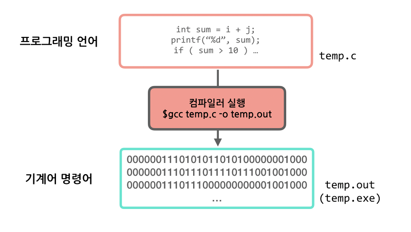

# 컴파일러와 인터프리터
 - 고급언어를 기계언어로 바꾸어 해석하는 프로그램
 
 ### 프로그래밍 언어란?
  컴퓨터 시스템을 구동시키는 소프트웨어를 작성하기 위한 형식언어.  
  고급언어일수록 사람이 사용하는 언어에 가깝다(ex 자바, 파이썬)
  
    
  
## 컴파일러

   사용하는 언어의 문법에 맞게 명령들을 작성하고 파일로 저장하는데 이를 원시파일(소스)라 부른다.
   이 소스는 고급언어이기 때문에 컴퓨터는 이해하지 못한다. (컴퓨터는 0과 1로 이루어진 이진수 기계어만 알아듣기 때문)
   컴퓨터가 이해할 수 있도록 소스를 기계어 코드로 번역하는 동작을 컴파일이라고 하며, 컴파일 작업을 하는 프로그램을 **컴파일러**라고 한다.

   컴파일러는 컴파일 결과로 목적파일(object file) 생성. 목적파일도 바로 실행할수는 없다. 목적파일을 실행파일로 만들어야 실행이 가능하다.
   목적파일을 실행파일로 만드는 동작을 **링크**라고 하고 링크해주는 프로그램을 **링커**라고한다.
   
   소스 파일은 컴파일러에 의해 컴파일되어 목적 파일이 되며 목적 파일은 링커에 의해 링크되어 최종적으로 실행 가능한 실행 파일이 되는데 이 과정을 
   **빌드(Build)** 라고 한다.
   
   
   
   
   
   최근 개발툴들은 자체에 편집기, 컴파일러, 링커를 모두 내장하고 있기 때문에 한 번에 소스를 실행 파일로 바꿀 수 있다.
   디버거, 프로파일러, 리소스 편집기 등 개발에 필요한 편의 기능까지 제공하는 환경을 통합 개발 환경(Integrated Development Environment)라 한다.
   
    
   
## 인터프리터

------------------------------------
참고 

(https://gayris.tistory.com/entry/%EC%BB%B4%ED%8C%8C%EC%9D%BC%EB%9F%AC%EC%9D%98-%EC%A2%85%EB%A5%98%EC%99%80-%EC%97%AD%ED%99%9C)
