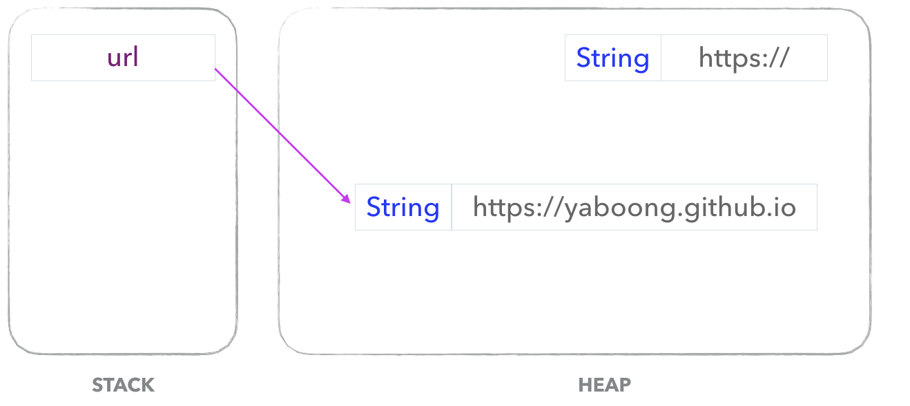
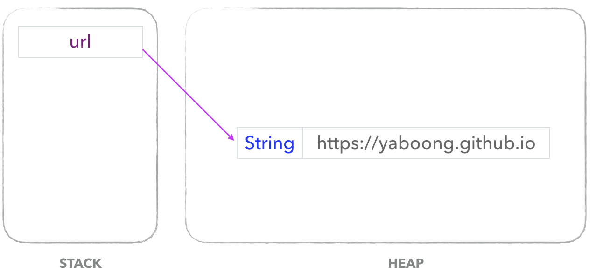

Garbage Collection 살짝 겉핥아보기
이제 간단한 코드를 살펴보면서 garbage collection 이 뭔지 살짝만 알아보자.

```java
public class Main {
    public static void main(String[] args) {
        String url = "https://";
        url += "yaboong.github.io";
        System.out.println(url);
    }
}
```

위 코드에서 `String url = "https://";` 구문이 실행된 뒤 스택과 힙은 아래와 같다.


다음 구문인 `url += "yaboong.github.io";` 문자열 더하기 연산이 수행되는 과정에서, (String 은 불변객체이므로) 기존에 있던 "https://" 스트링에 "yaboong.github.io" 를 덧붙이는 것이 아니라, 문자열에 대한 더하기 연산이 수행된 결과가 새롭게 heap 영역에 할당된다. 그 결과를 그림으로 표현하면 아래와 같다.



Stack 에는 새로운 변수가 할당되지 않는다. 문자열 더하기 연산의 결과인 "https://yaboong.github.io" 가 새롭게 heap 영역에 생성되고, 기존에 "https://" 를 레퍼런스 하고 있던 url 변수는 새롭게 생성된 문자열을 레퍼런스 하게 된다.

기존의 "https://" 라는 문자열을 레퍼런스 하고 있는 변수는 아무것도 없으므로 Unreachable 오브젝트가 된다.

JVM 의 Garbage Collector 는 Unreachable Object 를 우선적으로 메모리에서 제거하여 메모리 공간을 확보한다. Unreachable Object 란 Stack 에서 도달할 수 없는 Heap 영역의 객체를 말하는데, 지금의 예제에서 "https://" 문자열과 같은 경우가 되겠다. 아주 간단하게 이야기해서 이런 경우에 Garbage Collection 이 일어나면 Unreachable 오브젝트들은 메모리에서 제거된다.

Garbage Collection 과정은 Mark and Sweep 이라고도 한다. JVM의 Garbage Collector 가 스택의 모든 변수를 스캔하면서 각각 어떤 오브젝트를 레퍼런스 하고 있는지 찾는과정이 Mark 다. Reachable 오브젝트가 레퍼런스하고 있는 오브젝트 또한 marking 한다. 첫번째 단계인 marking 작업을 위해 모든 스레드는 중단되는데 이를 stop the world 라고 부르기도 한다. (System.gc() 를 생각없이 호출하면 안되는 이유이기도 하다)

그리고 나서 mark 되어있지 않은 모든 오브젝트들을 힙에서 제거하는 과정이 Sweep 이다.

Garbage Collection 이라고 하면 garbage 들을 수집할 것 같지만 실제로는 garbage 를 수집하여 제거하는 것이 아니라, garbage 가 아닌 것을 따로 mark 하고 그 외의 것은 모두 지우는 것이다. 만약 힙에 garbage 만 가득하다면 제거 과정은 즉각적으로 이루어진다.

Garbage Collection 이 일어난 후의 메모리 상태는 아래와 같을 것이다.



## 가비지 컬렉터?

가비지 컬렉터는 메모리가 부족할 때 쓰레기(가비지)를 정리해주는 프로그램을 말한다.

프로그램을 실행하다보면 가비지가 발생하게 되는데, 이놈들은 유효한 메모리가 아니다.

그렇게 되면 정리되지 않은 채로 남겨져있는 메모리들은 사용되지도 않으면서 자리를 차지하고 있게된다.

때문에 JVM의 가비지 컬렉터는 가비지를 다른 용도로 사용할 수 있게 '메모리 해제'를 시키는 프로그램이다.

## 가비지 컬렉터는 언제 실행되는가?
JVM은 메모리를 부여받고 열심히 프로그램들을 실행하다가 메모리가 부족해지는 순간이 오면 OS에게 추가로 메모리를 더 요청하게 된다.

바로 이 메모리를 더 달라고 요청하는 때에 가비지 컬렉터(Garbage Collector)가 실행된다.

또, 서버 프로그램인 경우에는 24시간 내내 돌아가는데, 이 때에는 JVM이 한가할 때(idle time) 가비지 컬렉터가 실행된다.

(JVM이 종료되면, 당연히 사용하던 모든 메모리는 OS에게 반납된다.)
