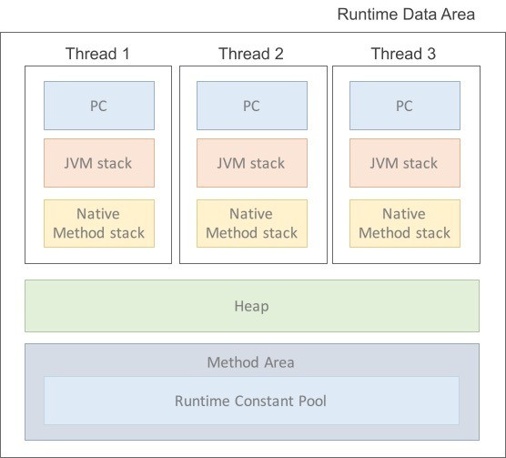

# JVM

## JVM (Java Virtual Machine)

자바 가상 머신으로 자바 바이트 코드를 실행할 수 있는 주체이다.*(가상머신이란 프로그램을 실행하기 위해 물리적 머신과 유사한 머신을 소프트웨어로 구현한 것이다.)* CPU나 운영체제의 종류와 무관하게 실행이 가능하다. 즉, 운영체제 위에서 동작하는 프로세스로 **자바코드를 컴파일해서 얻은 바이트 코드를 해당 운영체제가 이해할 수 있는 기계어로 바꿔 실행시켜주는 역할을 한다.** 또한 프로그램 메모리를 관리하고 최적화하는 역할을 한다.

## 자바프로그램 실행과정
1. 프로그램이 실행되면 JVM은 OS로부터 이 프로그램이 필요로 하는 메모리를 할당받는다.
   JVM은 이 메모리를 용도에 따라 여러 영역으로 나누어 관리한다.
2. 자바 컴파일러(javac)가 자바 소스코드(.java)를 읽어들여 자바 바이트코드(.class)로 변환시킨다.
3. Class Loader를 통해 class파일들을 JVM으로 로딩한다.
4. 로딩된 class파일들은 Execution engine을 통해 해석된다.
5. 해석된 바이트코드는 Runtime Data Areas 에 배치되어 실질적인 수행이 이루어지게 된다.
이러한 실행과정 속에서 JVM은 필요에 따라 Thread Synchronization과 GC같은 관리작업을 수행한다.

## JVM 구성

### Class Loader (클래스 로더)

자바에서 소스를 작성하면 .java파일이 생성된다. .java 소스르 자바컴파일러가 컴파일하면 .class파일(바이트코드)이 생성된다. 이렇게 생성된 클래스파일들을 엮어서 JVM이 운영체제로부터 할당받은 메모리 영역인 Runtime Data Area로 적재하는 역할을 `Class Loader`가 한다.

 - Loading : 클래스 파일에서 클래스 이름, 상속관계, 클래스의 타입(class, interface, enum) 정보, 메소드 & 생성자 & 멤버변수 정보, 상수 등에 대한 정보를 로딩해서 Binary 데이터로 변경한다.
 - Linking : Verification 과 Preparation, Resolution 단계를 거치면서 바이트코드를 검증하고 필요한 만큼의 메모리를 할당한다. Resolution 과정에서는 Symbolic Reference 를 Direct Reference 등으로 바꿔준다.
 - Initialization : static block 의 초기화 및 static 데이터들을 할당한다. Top->Bottom 방식으로 클래스들을 해석한다.

### Execution Engine (실행 엔진)

`Class Loader`에 의해 메모리에 적재된 클래스(바이트 코드)들을 기계어로 변경해 명령어 단위로 실행하는 역할을 한다. 명령어를 하나 하나 실행하는 인터프리터(Interpreter)방식이 있고 JIT(Just-In-Time) 컴파일러를 이용하는 방식이 있다. JIT 컴파일러는 적절한 시간에 전체 바이트 코드를 네이티브 코드로 변경해서 Execution Engine이 네이티브로 컴파일된 코드를 실행하는 것으로 성능을 높이는 방식이다.

<참고>

Interpreter(인터프리터)
실행 엔진은 자바 바이트 코드를 명령어 단위로 읽어서 실행한다. 하지만 이 방식은 인터프리터 언어의 단점을 그대로 갖고 있다. 한 줄 씩 수행하기 때문에 느리다는 것이다.

JIT(Just - In - Time)
인터프리터 방식의 단점을 보완하기 위해 도입된 JIT 컴파일러이다. 인터프리터 방식으로 실행하다가 적절한 시점에 바이트코드 전체를 컴파일하여 네이티브 코드로 변경하고, 이후에는 해당 더 이상 인터프리팅 하지 않고 네이티브 코드로 직접 실행하는 방식이다. 네이티브 코드는 캐시에 보관하기 때문에 한 번 컴파일된 코드는 빠르게 수행하게 된다. 물론 JIT컴파일러가 컴파일하는 과정은 바이트코드를 인터프리팅하는 것보다 훨씬 오래걸리므로 한 번만 실행되는 코드라면 컴파일하지 않고 인터프리팅하는 것이 유리하다. 따라서 JIT 컴파일러를 사용하는 JVM들은 내부적으로 해당 메서드가 얼마나 자주 수행되는지 체크하고, 일정 정도를 넘을 때에만 컴파일을 수행한다. 

### Garbage collector

`Garbage Collector(GC)`는 Heap 메모리 영역에 생성(적재)된 객체들 중에 참조되지 않는 객체들을 탐색 후 제거하는 역할을 한다.  개발자가 따로 메모리를 관리하지 않아도 되므로 손 쉽게 프로그래밍을 할 수 있게 도와준다.

### Runtime Data Area

JVM의 메모리 영역으로 자바 애플리케이션을 실행할 때 사용되는 데이터들을 적재하는 영역이다.
이 영역은 크게 Method Area, Heap Area, Stack Area, PC Register, Native Method Stack로 나눌 수 있다.

## 자바 런타임 메모리(Runtime Data area)구조

쓰레드가 생성되었을 때 기준으로 메소드 영역과 힙 영역을 모든 쓰레드가 공유하고, 스택 영역과 PC 레지스터, Native method stack은 각각의 쓰레드마다 생성되고 공유되지 않는다.

### Method area (메소드 영역)

클래스 멤버 변수의 이름, 데이터 타입, 접근 제어자 정보같은 필드 정보와 메소드의 이름, 리턴 타입, 파라미터, 접근 제어자 정보같은 메소드 정보, Type정보(Interface인지 class인지), Constant Pool(상수 풀 : 문자 상수, 타입, 필드, 객체 참조가 저장됨), static 변수, final class 변수등이 생성되는 영역이다.

### Heap area (힙 영역)

`new 키워드`로 생성된 객체와 배열이 생성되는 영역이다. 메소드 영역에 로드된 클래스만 생성이 가능하고 Garbage Collector가 참조되지 않는 메모리를 확인하고 제거하는 영역이다.

### Stack area (스택 영역)

지역 변수, 파라미터, 리턴 값, 연산에 사용되는 임시 값등이 생성되는 영역으로, 프로그램 실행과정에서 임시로 할당되었다가 메소드를 빠져나가면 바로 소멸되는 특성의 데이터를 저장하기 위한 영역이다.

`int a = 10;` 이라는 소스를 작성했다면 정수값이 할당될 수 있는 메모리공간을 a라고 잡아두고 그 메모리 영역에 값이 10이 들어간다. 즉, 스택에 메모리에 이름이 a라고 붙여주고 값이 10인 메모리 공간을 만든다.

클래스 `Person p = new Person();` 이라는 소스를 작성했다면 Person p는 스택 영역에 생성되고 new로 생성된 Person 클래스의 인스턴스는 힙 영역에 생성된다.

그리고 스택영역에 생성된 p의 값으로 힙 영역의 주소값을 가지고 있다. 즉, 스택 영역에 생성된 p가 힙 영역에 생성된 객체를 가리키고(참조하고) 있는 것이다.

메소드를 호출할 때마다 개별적으로 스택이 생성된다.

### PC Register (PC 레지스터)

Thread(쓰레드)가 생성될 때마다 생성되는 영역으로 스레드마다 하나씩 존재한다. Thread가 어떤 부분을 어떤 명령으로 실행해야할 지에 대한 기록을 하는 부분으로 현재 수행 중인 JVM 명령의 주소를 갖는다. 

### Native method stack

자바 외 언어로 작성된 네이티브 코드를 위한 메모리 영역이다. 보통 C/C++등의 코드를 수행하기 위한 스택이다. (JNI)

