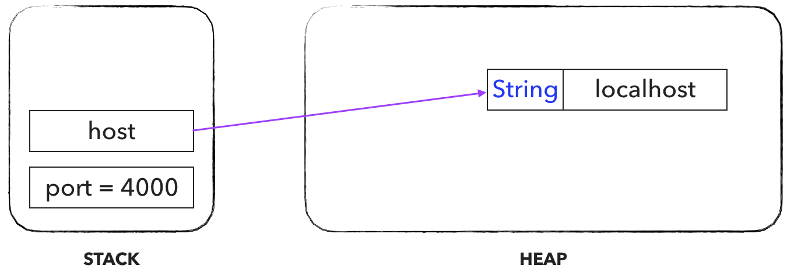
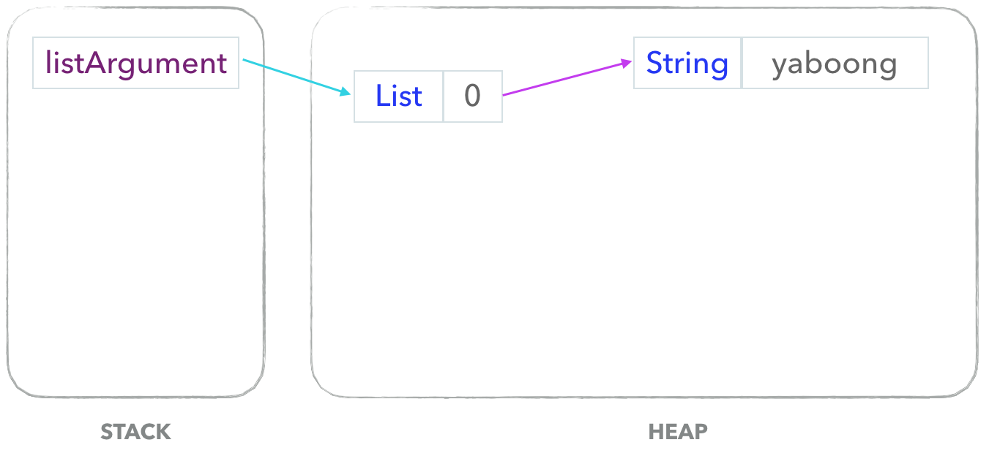
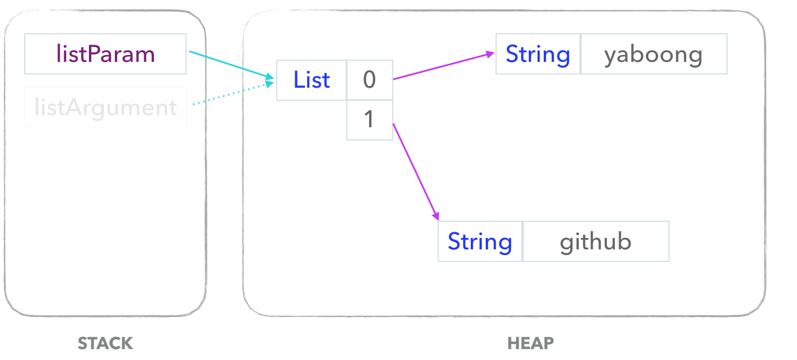
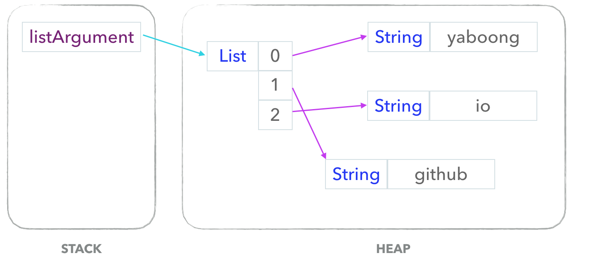

# 자바의 메모리관리 ( Stack & Heap )

## Stack

- Heap 영역에 생성된 Object 타입의 데이터의 참조값이 할당된다.
- 원시타입의 데이터가 값과 함께 할당된다.
- 지역변수들은 scope 에 따른 visibility 를 가진다.
- 각 Thread 는 자신만의 stack 을 가진다.

Stack 에는 heap 영역에 생성된 Object 타입의 데이터들에 대한 참조를 위한 값들이 할당된다. 또한, 원시타입(primitive types) - byte, short, int, long, double, float, boolean, char 타입의 데이터들이 할당된다. 이때 원시타입의 데이터들에 대해서는 참조값을 저장하는 것이 아니라 실제 값을 stack 에 직접 저장하게 된다.

Stack 영역에 있는 변수들은 visibility 를 가진다. 변수 scope 에 대한 개념이다. 전역변수가 아닌 지역변수가 foo() 라는 함수내에서 Stack 에 할당 된 경우, 해당 지역변수는 다른 함수에서 접근할 수 없다. 예를들어, foo() 라는 함수에서 bar() 함수를 호출하고 bar() 함수의 종료되는 중괄호 } 가 실행된 경우 (함수가 종료된 경우), bar() 함수 내부에서 선언한 모든 지역변수들은 stack 에서 pop 되어 사라진다.

Stack 메모리는 Thread 하나당 하나씩 할당된다. 즉, 스레드 하나가 새롭게 생성되는 순간 해당 스레드를 위한 stack 도 함께 생성되며, 각 스레드에서 다른 스레드의 stack 영역에는 접근할 수 없다.

이제 Stack 이 어떻게 활용되는지 간단한 코드를 보면서 하나씩 살펴보자.

```java
public class Main {
    public static void main(String[] args) {
        int argument = 4;
        argument = someOperation(argument);
    }

    private static int someOperation(int param){
        int tmp = param * 3;
        int result = tmp / 2;
        return result;
    }
}
```

`int argument = 4`에 의해 스택이 `argument`라는 변수명으로 공간이 할당되고, `argument` 변수의 타입은 원시타입이므로ㅗ 이 고간에서 실제 4라는 값이 할당된다.


`argument = someOperation(argument);`에 의해 `someOperation()`함수가 호출된다. 호출될때 인자로 `argument` 변수를 넘겨주며 범위가 `someOperation()`함수로 이동한다. scope 가 바뀌면서 기존의 argument 라는 값은 scope 에서 벗어나므로 사용할 수 없다. 이때 인자로 넘겨받은 값은 파라미터인 param 에 복사되어 전달되는데, param 또한 원시타입이므로 stack 에 할당된 공간에 값이 할당된다. 


`int tmp = param * 3;`와 `int result = tmp / 2;`에 의해 같은 방식으로 스택에 값이 할당된다.


다음으로, 닫는괄호 `}` 가 실행되어 `someOperation()` 함수호출이 종료되면 호출함수 scope 에서 사용되었던 모든 지역변수들은 stack 에서 pop 된다. 함수가 종료되어 지역변수들이 모두 pop 되고, 함수를 호출했던 시점으로 돌아가면 스택의 상태는 아래와 같이 변한다.


argument 변수는 4 로 초기화 되었지만, 함수의 실행결과인 6 이 기존 argument 변수에 재할당된다. 물론 함수호출에서 사용되었던 지역변수들이 모두 pop 되기 전에 재할당 작업이 일어날 것이다.

그리고 main() 함수도 종료되는 순간 stack 에 있는 모든 데이터들은 pop 되면서 프로그램이 종료된다.

## Heap

- Heap 영역에는 주로 긴 생명주기를 가지는 데이터들이 저장된다. (대부분의 오브젝트는 크기가 크고, 서로 다른 코드블럭에서 공유되는 경우가 많다)
애플리케이션의 모든 메모리 중 stack 에 있는 데이터를 제외한 부분이라고 보면 된다.
- 모든 Object 타입(Integer, String, ArrayList, ...)은 heap 영역에 생성된다.
- 몇개의 스레드가 존재하든 상관없이 단 하나의 heap 영역만 존재한다.
- Heap 영역에 있는 오브젝트들을 가리키는 레퍼런스 변수가 stack 에 올라가게 된다.

간단한 코드예제와 함께 heap 영역이 어떻게 사용되는지 살펴보자.

```java
public class Main {
    public static void main(String[] args) {
        int port = 4000;
        String host = "localhost";
    }
}
```

`int port = 4000;` 에 의해서 기존처럼 stack 에 4000 이라는 값이 port 라는 변수명으로 할당되어 스택의 상태는 아래와 같이 된다.


String 은 Object 를 상속받아 구현되었으므로 (Object 타입은 최상위 부모클래스다, Polymorphism 에 의해 Object 타입으로 레퍼런스 가능하다) String 은 heap 영역에 할당되고 stack 에 host 라는 이름으로 생성된 변수는 heap 에 있는 “localhost” 라는 스트링을 레퍼런스 하게 된다. 그림으로 표현하면 아래와 같다.



## 각 영역의 메모리 할당과 해제

만약 이런 코드가 있다면 !

```java
import java.util.ArrayList;
import java.util.List;

public class Main {
    public static void main(String[] args) {
        List<String> listArgument = new ArrayList<>();
        listArgument.add("yaboong");
        listArgument.add("github");

        print(listArgument);
    }

    private static void print(List<String> listParam) {
        String value = listParam.get(0);
        listParam.add("io");
        System.out.println(value);
    }
}
```

```java
List<String> listArgument = new ArrayList<>();
```

여기서 `new` 키워드는 특별한 역할을 한다. 생성하려는 오브젝트를 저장할 수 있는 충분한 공간이 heap 에 있는지 먼저 찾은 다음, 빈 List 를 참조하는 listArgument 라는 로컬변수를 스택에 할당한다. 결과는 아래와 같다.


다음으로, `listArgument.add("yaboong");` 구문이 실행되는데, 위 구문은 listArgument.add(new String("yaboong")); 과 같은 역할을 한다. 즉, new 키워드에 의해 heap 영역에 충분한 공간이 있는지 확인한 후 “yaboong” 이라는 문자열을 할당하게 된다. 이때 새롭게 생성된 문자열인 “yaboong” 을 위한 변수는 stack 에 할당되지 않는다. List 내부의 인덱스에 의해 하나씩 add() 된 데이터에 대한 레퍼런스 값을 갖게 된다. 그림으로 표현하면 아래와 같다.



다음으로, `listArgument.add("github");` 가 실행되면 List 에서 레퍼런스 하는 문자열이 하나 더 추가된다. 그림으로 표현하면 아래와 같다.


다음으로, `print(listArgument);` 구문에 의해 함수호출이 일어난다. 이때, listArgument 라는 참조변수를 넘겨주게 된다. 함수호출시 원시타입의 경우와 같이 넘겨주는 인자가 가지고 있는 값이 그대로 파라미터에 복사된다.

print(List<String> listParam) 메소드에서는 listParam 이라는 참조변수로 인자를 받게 되어있다. 따라서 print() 함수호출에 따른 메모리의 변화는 아래와 같다.



listParam 이라는 참조변수가 새롭게 stack 에 할당되어 기존 List 를 참조하게 되는데, 기존에 인자인 listArgument 가지고 있던 값(List 에 대한 레퍼런스)을 그대로 listParam 이 가지게 되는 것이다. 그리고 print() 함수 내부에서 listArgument 는 scope 밖에 있게 되므로 접근할 수 없는 영역이 된다.

다음으로, print() 함수 내부에서는 List 에 있는 데이터에 접근하여 값을 value 라는 변수에 저장한다. 이 때 print() 함수의 scope 에서 stack 에 value 가 추가되고, 이 value 는 listParam 을 통해 List 의 0번째 요소에 접근하여 그 참조값을 가지게 된다. 그리고나서 또 데이터를 추가하고, 출력함으로 print() 함수의 역할은 마무리 된다.

```java
String value = listParam.get(0);
listParam.add("io");
System.out.println(value);
```

위 코드가 실행되고, 함수가 종료되기 직전의 stack 과 heap 은 아래와 같다.


이제 함수가 닫는 중괄호 } 에 도달하여 종료되면 print() 함수의 지역변수는 모두 stack 에서 pop 되어 사라진다. 이때, List 는 Object 타입이므로 지역변수가 모두 stack 에서 pop 되더라도 heap 영역에 그대로 존재한다. 즉, 함수호출시 레퍼런스 값을 복사하여 가지고 있던 listParam 과 함수내부의 지역변수인 value 만 스택에서 사라지고 나머지는 모두 그대로인 상태로 함수호출이 종료된다.

`print(listArgument);` 위 함수호출이 종료된 시점에서 스택과 힙 영역은 아래와 같다.



Object 타입의 데이터, 즉 heap 영역에 있는 데이터는 함수 내부에서 파라미터로 copied value 를 받아서 변경하더라도 함수호출이 종료된 시점에 변경내역이 반영되는 것을 볼 수 있다.