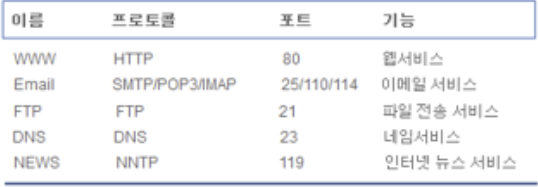

# 인터넷(Internet)과 웹(WWW)

인터넷은 __컴퓨터가 서로 연결되어 통신을 주고받는 컴퓨터끼리의 네트워크__ 를 일컫는 말이고, 
웹은 그 __인터넷상에 정보가 얽혀있는 무형의 정보 네트워크__ 를 말한다. 
인터넷에선 웹뿐 아니라 전자 메일과 같이 다른 서비스가 쓰이기도 하고, 웹은 그런 서비스 중 하나다. 
하지만 인터넷의 활용도에 있어 웹이 차지하는 비중이 워낙 높다 보니 두 단어가 거의 같은 의미로 쓰이기도 한다.

 
 

## 인터넷이란?

인터넷(Internet)이란 여러 통신망을 하나로 연결한다는 의미의 ‘인터 네트워크(inter-network)’라는 말에서 시작되었으며, 
전 세계 컴퓨터들을 하나로 연결하는 거대한 컴퓨터 통신망을 의미한다. 
인터넷은 클라이언트와 서버로 구성되며, TCP/IP라는 기본 프로토콜을 통해 제공되고 있다.

### 구성

여러 대의 컴퓨터가 각각 클라이언트와 서버로 서로 연결되어 구성된 망을 컴퓨터 네트워크(computer network)라고 한다. 
인터넷은 이러한 컴퓨터 네트워크가 전 세계적인 규모로 수없이 많이 모여서 이루어진 일종의 컴퓨터 네트워크 시스템이다.

### 특징

1. 인터넷은 서로 동시에 참여할 수 있는 양방향 통신

2. 시간에 제약을 받지 않고 통신 가능

3. 텍스트, 이미지, 음성, 동영상 등 다양한 포맷으로 통신 가능

4. 익명성을 제공

 

## WWW이란?

월드 와이드 웹(World Wide Web)이란 인터넷에 연결된 사용자들이 서로의 정보를 공유할 수 있는 공간을 의미한다. 간단히 줄여서 WWW나 W3라고도 부르며, 간단히 웹(Web)이라고 가장 많이 불린다.

### 구성

웹에서는 HTML 언어를 사용하여 작성된 하이퍼텍스트 문서를 웹 페이지(web page)라고 부른다. 
이러한 웹 페이지들 중에서 서로 관련된 내용으로 작성된 웹 페이지들의 집합을 웹 사이트(web site)라고 한다. 웹은 이렇게 작성된 수많은 웹 페이지들이 하이퍼링크(hyperlink)를 통해 서로 연결되어 구성된다.

유저가 웹 페이지에 포함된 하이퍼링크를 따라 다른 웹 페이지로 계속 이동하는 것을 웹 서핑(web surfing)이라고 부르며, 이때 유저가 웹 페이지를 보기 위해 사용하는 프로그램을 웹 브라우저(web browser)라고 한다. 

대표적인 웹 브라우저로 인터넷 익스플로러 Internet Explorer, 크롬 Chrome, 파이어폭스 Firefox, 오페라 Opera, 사파리 Safari가 있다.

### 특징

1. 인터넷 상에서 텍스트나 그림, 소리, 영상 등과 같은 멀티미디어 정보를 하이퍼텍스트 방식으로 연결하여 제공

2. HTML이라는 언어를 사용하여 누구나 자신만의 문서를 작성, 작성된 웹상의 문서에 HTTP라는 프로토콜을 사용하면 누구나 검색하고 접근
* 하이퍼텍스트(hypertext)란 문서 내부에 또 다른 문서로 연결되는 참조를 집어 넣음으로써 웹 상에 존재하는 여러 문서끼리 서로 참조할 수 있는 기술
* 문서 내부에서 또 다른 문서로 연결되는 참조를 하이퍼링크(hyperlink)

